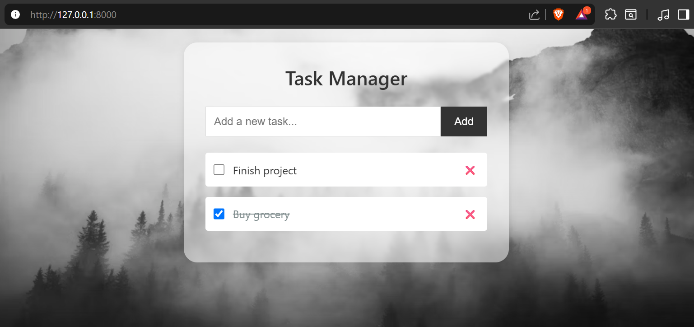

# 📝 Django Task Manager

A minimal and clean web based task manager built with Django REST Framework. Add, update, delete, and mark tasks as complete with a stylish and responsive UI.

## 🚀 Features

- ✅ Create new tasks
- ✏️ Update task titles
- 🗑️ Delete tasks
- ☑️ Mark tasks as complete/incomplete using a checkbox
- 🎨 Strikethrough styling for completed tasks
- 📱 Mobile responsive design

## 🖼️ Screenshots

> 

---

## 🛠️ Tech Stack

- **Backend:** Django, Django Rest Framework
- **Frontend:** HTML, CSS (custom), pure JS
- **Database:** SQLite (default Django DB)

---

## 📦 Setup Instructions

### 1. Clone the repository

```bash
git clone https://github.com/krishnaverma001/todo.git
cd todo
```

### 2. Create and Activate a Virtual Environment
```bash
python -m venv venv
source venv/bin/activate  # On Windows use: venv\Scripts\activate
```

### 3. Install Dependencies
```bash
pip install -r requirements.txt
```

### 4. Apply Migrations
```bash
python manage.py migrate
```
### 5. Run the Development Server
```bash
python manage.py runserver
```

Now open your browser and go to:
http://127.0.0.1:8000/

## 🧑‍💻 Author
Krishna Verma

GitHub: @krishnaverma001

This project is for learning and demonstration purposes.